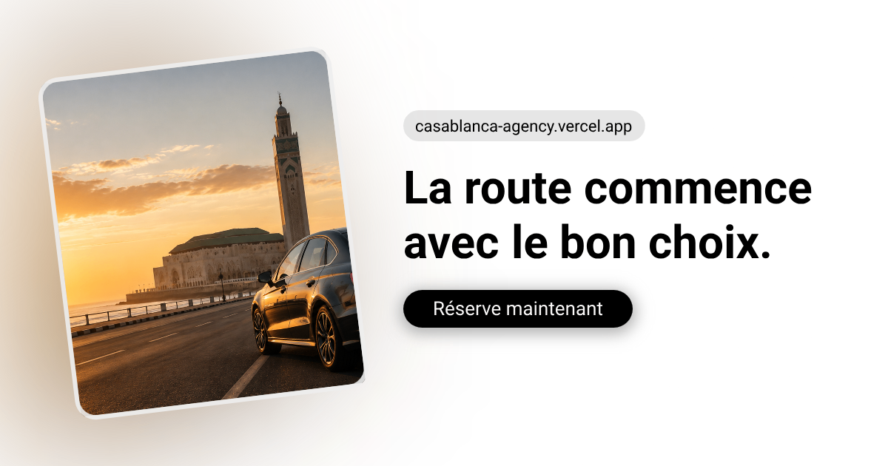

# Casablanca Agency



A responsive, French-language car-rental website for Casablanca. Visitors can browse and filter a vehicle catalogue, submit a pre-booking request through WhatsApp, and contact the agency through an EmailJS-powered form.

[View the live site](https://casablanca-agency.vercel.app/)

## Features

- Responsive landing page with a hero section, featured vehicles, customer reviews, and service benefits
- Catalogue of 30 vehicles with search, category, fuel, price, and availability information
- Client-side pagination with nine vehicles per page
- Accessible booking modal with date validation and a pre-filled WhatsApp message
- Contact page with WhatsApp, telephone, email, Google Maps, and EmailJS integration
- About, terms, privacy, legal notice, and custom 404 pages
- Per-page titles, descriptions, canonical links, Open Graph/Twitter metadata, and `noindex` support
- JSON-LD business data, `robots.txt`, and an XML sitemap
- Vercel rewrite configuration for React Router routes

> The website collects booking enquiries only. It does not confirm availability, process payments, or store reservations in a backend.

## Tech stack

| Area | Technology |
| --- | --- |
| UI | React 19, custom CSS, Bootstrap Icons |
| Tooling | Vite 8, ESLint 10 |
| Routing | React Router 7 |
| SEO | React Helmet Async, JSON-LD, Open Graph |
| Contact | EmailJS |
| Deployment | Vercel |

## Getting started

### Prerequisites

- Node.js `^20.19.0` or `>=22.12.0`
- npm

### Installation

```bash
git clone https://github.com/SaouiYassir/Casablanca-agency.git
cd Casablanca-agency
npm ci
npm run dev
```

Open the local URL printed by Vite, normally `http://localhost:5173`.

## Configuration

### Agency information

Edit [`src/Config/Agency.js`](./src/Config/Agency.js) to update the agency name, telephone number, WhatsApp number, email address, location, opening hours, social links, and business rules.

### Vehicle catalogue

The fleet is currently maintained as a static array in [`src/Data/Catalogue.js`](./src/Data/Catalogue.js). Each entry can provide:

```js
{
  id: 1,
  marque: 'Peugeot',
  modèle: '208',
  année: 2022,
  prixParJour: 45,
  status: 'Disponible',
  type: 'Citadine',
  fuel: 'Essence',
  image: 'https://example.com/car.jpg'
}
```

Cards also support optional `transmission`, `rating`, `seats`, `luggage`, and `ac` properties. Until supplied, the UI uses sensible fallback values.

### EmailJS contact form

Create a `.env.local` file in the project root:

```dotenv
VITE_EMAILJS_SERVICE_ID=your_service_id
VITE_EMAILJS_TEMPLATE_ID=your_template_id
VITE_EMAILJS_PUBLIC_KEY=your_public_key
```

The EmailJS template should accept these fields:

- `from_name`
- `from_email`
- `subject`
- `message`
- `time`

If the variables are missing, the form shows an explanatory message and directs visitors to WhatsApp.

### Domain and SEO

If the production domain changes, update every public URL in:

- [`src/Config/Agency.js`](./src/Config/Agency.js)
- [`src/Components/SEO/SEO.jsx`](./src/Components/SEO/SEO.jsx)
- [`index.html`](./index.html)
- [`public/robots.txt`](./public/robots.txt)
- [`public/sitemap.xml`](./public/sitemap.xml)

## Available scripts

| Command | Purpose |
| --- | --- |
| `npm run dev` | Start the development server |
| `npm run build` | Create the production build in `dist/` |
| `npm run preview` | Preview the production build locally |
| `npm run lint` | Run ESLint across the project |

## Routes

| Route | Page |
| --- | --- |
| `/` | Home and featured vehicles |
| `/catalogue` | Searchable, filterable vehicle catalogue |
| `/about` | Agency overview and booking process |
| `/contact` | Contact channels, form, and map |
| `/conditions` | General terms |
| `/confidentialite` | Privacy policy |
| `/mentions-legales` | Legal notice |
| `*` | Custom 404 page |

## Project structure

```text
Casablanca-agency/
├── public/                  # Favicon, social preview, robots, and sitemap
├── src/
│   ├── Components/          # Shared cards, navigation, forms, modal, and SEO
│   ├── Config/              # Agency-wide contact and business settings
│   ├── Data/                # Static vehicle catalogue
│   ├── Pages/               # Home, catalogue, contact, legal, and 404 pages
│   ├── App.jsx              # Router and shared page layout
│   ├── index.css            # Global styles
│   └── main.jsx             # React entry point
├── index.html               # Base metadata and structured data
├── vercel.json              # Single-page application rewrite
└── vite.config.js           # Vite configuration
```

## Deployment

The project is ready for Vercel:

1. Import the GitHub repository into Vercel.
2. Keep the detected Vite build settings.
3. Add the three `VITE_EMAILJS_*` environment variables if the contact form is enabled.
4. Deploy.

The included [`vercel.json`](./vercel.json) sends direct visits to client-side routes back to `index.html`.

## Before production use

- Replace sample vehicle photos, prices, statuses, and testimonials with verified business data.
- Complete every placeholder in the terms and legal notice, including company registration and contact details.
- Make the agency name, email address, phone number, and site URL consistent across configuration, content, metadata, and structured data.
- Confirm the cancellation, payment, driver-age, and licence rules with the business.
- Configure EmailJS and test message delivery from the production domain.
- Confirm that all vehicle availability and prices are clearly presented as indicative until the agency approves the booking.
